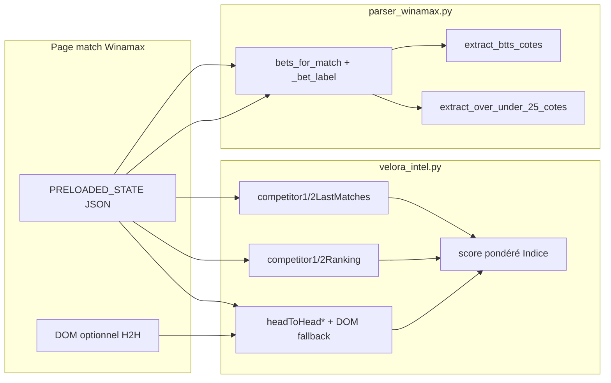

# Audit scraper Winamax — sélecteurs et robustesse

Ce document décrit **exactement** ce que le code utilise aujourd’hui (pas de CSS/XPath figés sur le HTML Winamax pour les cotes marchés). La source principale est le JSON embarqué **`window.PRELOADED_STATE`**, lu via Playwright.

---

## 1. BTTS (Les deux équipes marquent)

### Mécanisme

| Étape | Fichier | Méthode |
|--------|---------|---------|
| Lecture état page | `winamax_sniper.py` | `fetch_preloaded_state()` → `window.PRELOADED_STATE` |
| Paris du match | `parser_winamax.py` | `bets_for_match(state["bets"], id_match)` |
| Filtrage marché | `parser_winamax.py` | `extract_btts_cotes()` → `_is_btts_bet(name)` |
| Cotes Oui/Non | `parser_winamax.py` | `lookup_odd(odds, outcome_id)` |

### « Sélecteurs » réels (pas CSS)

**Identification du pari BTTS** — texte normalisé de `_bet_label(bet)` :

```python
# parser_winamax.py — _is_btts_bet(name)
("deux" in name and "marquent" in name)
or "btts" in name
or ("les 2" in name and "marquent" in name)
or name in ("les 2 équipes marquent", "les 2 equipes marquent")
```

Exclusions : `mi-temps`, `double chance`, `résultat` dans le nom du pari.

**Côté Oui / Non** — champs JSON `outcomes[id].label` et `.code` :

```python
# _btts_outcome_side(out)
"oui" in label  OR code in ("yes", "oui", "o")
"non" in label  OR code in ("no", "non", "n")
```

**Probabilité % (sans cote)** — `extract_btts_oui()` : même filtre de nom + `percentDistribution` / `probability` sur l’outcome « Oui ».

### XPath / CSS

**Aucun** pour les cotes BTTS. Tout passe par `PRELOADED_STATE.bets` + `outcomes` + `odds`.

### Extraction buteurs (mise à jour)

- Pari accepté si `betFilterName` ∈ {`Buteur`, `Buteurs`, `Marqueur`, `Marqueurs`} (pas un pari combiné 1N2).
- Nom joueur : `outcome.player.name`, `playerName`, puis `label` si ce n’est pas une issue 1N2 (`Match nul`, code `1`/`2`/`x`, etc.).
- **Aucun CSS/XPath** pour les noms de joueurs.

### Robustesse

| Risque | Niveau | Détail |
|--------|--------|--------|
| Renommage libellé pari | Moyen | Si Winamax change « Les 2 équipes marquent » sans « deux »/« marquent »/« btts », le marché est ignoré. |
| Structure JSON | Faible–Moyen | Si `bets` / `outcomes` / `odds` changent de clés, tout le parser casse. |
| Mise en page HTML | Faible | Pas de dépendance DOM pour BTTS. |
| LIVE | — | Matchs `LIVE` exclus du parser ; cotes O/U > 5.00 ignorées. |

---

## 2. Plus / Moins 2,5 buts

### Mécanisme

| Étape | Fichier | Méthode |
|--------|---------|---------|
| Lignes buts | `parser_winamax.py` | `extract_plus_moins_buts()` |
| Filtre marché | `_is_goals_total_bet(name)` | |
| Ligne 2,5 | `_parse_ou_side_line(out.label)` | regex sur le label outcome |
| Export compact | `extract_over_under_25_cotes()` | lit `plus_moins_buts["2.5"]` |

### « Sélecteurs » réels

**Identification du pari total buts** :

```python
# _is_goals_total_bet(name)
"nombre de buts" in name
OR ("total" in name AND "but" in name)
OR ("plus/moins" in name AND "but" in name)
OR "nb de buts" / "nb buts" in name
```

Exclusions : mi-temps, 1ère mi-temps, paris « équipe » (sauf « nombre de buts »).

**Plus / Moins + ligne (1.5, 2.5, 3.5)** — regex sur `outcome.label` :

```python
# _parse_ou_side_line(label)
re.search(r"(plus|moins)\s*(?:de\s*)?(\d+(?:\.\d+)?)", label)
# ligne acceptée si dans ("1.5", "2.5", "3.5")
```

**Cote** : `lookup_odd(odds, outcome_id)` → `plus_cote` / `moins_cote` dans l’objet ligne.

**Probabilité over 2,5 (tendance)** : `extract_over_25_prob()` — parcours paris « total »/« but » + label outcome contenant `plus` et `2.5` / `2,5` ou `specialBetValue` 2.5.

### XPath / CSS

**Aucun** pour O/U 2,5.

### Robustesse

| Risque | Niveau | Détail |
|--------|--------|--------|
| Libellés « Plus de 2,5 buts » | Moyen | La regex exige `plus`/`moins` + nombre ; format anglais ou libellé raccourci peut échouer. |
| Ligne 2,75 only | Moyen | Seules 1.5 / 2.5 / 3.5 sont gardées. |
| Paris buts par équipe | Faible | Partiellement exclus par le filtre `équipe`. |

---

## 3. Historique / statistiques (forme, classement, H2H)

### A. JSON PRELOADED_STATE (prioritaire)

| Donnée | Clé JSON sur l’objet `matches[id]` | Fichier |
|--------|-------------------------------------|---------|
| Forme domicile (5 matchs) | `competitor1LastMatches` (ex. `"WLDDW"`) | `velora_intel.py` |
| Forme extérieur | `competitor2LastMatches` | `velora_intel.py` |
| Classement domicile | `competitor1Ranking` (entier) | `velora_intel.py` |
| Classement extérieur | `competitor2Ranking` | `velora_intel.py` |
| Face-à-face | `headToHead`, `headToHeadStats`, `h2h`, `competitor1HeadToHead`, `versus`, ou `headToHeadLabel` | `velora_intel.py` |

**Pas de CSS** pour la forme ni le classement : uniquement ces champs dans le JSON page match.

**Seuil « stats suffisantes »** (indice calculable) : ≥ **3** matchs de forme connus par équipe (`MIN_MATCHS_FORME` dans `velora_intel.py`).

### B. DOM Playwright (complément H2H uniquement)

Exécuté dans `extract_intel_from_page()` :

| Cible | Sélecteur CSS / logique |
|--------|-------------------------|
| Bloc H2H direct | `document.querySelector('[class*="head-to-head"], [class*="headtohead"], [data-test*="h2h"]')` → `innerText` |
| Fallback texte | `document.querySelectorAll('section, div, article')` puis test regex `/face\s*à\s*face/i` sur `innerText` (blocs &lt; 400 car.) |

**XPath** : non utilisé.

### Robustesse stats

| Risque | Niveau | Détail |
|--------|--------|--------|
| Champs JSON absents | **Élevé** | Beaucoup de matchs n’ont pas `competitor1LastMatches` → indice **Non calculable** (comportement voulu). |
| Classes CSS H2H | **Élevé** | Sélecteurs `[class*="head-to-head"]` cassent si Winamax renomme les classes (BEM / hash). |
| Forme en autre format | Moyen | Seuls `W`, `D`, `L` sont comptés ; autre encodage = forme vide. |

---

## 4. Synthèse architecture



---

## 5. Recommandations

1. **Logger** dans le sniper les matchs sans `competitor1LastMatches` / `competitor2LastMatches` pour mesurer le taux « Non calculable ».
2. **BTTS / O/U** : ajouter des alias de libellés Winamax dans `_is_btts_bet` / `_is_goals_total_bet` dès qu’un marché manque en prod.
3. **H2H** : préférer les champs JSON ; ne garder le DOM qu’en secours, avec log si le sélecteur CSS ne matche plus.
4. **Tests** : conserver un extrait de `PRELOADED_STATE` réel (dump) et tester `extract_btts_cotes` / `extract_intel_from_state` sans navigateur.

---

## 6. Indice Velora (rappel logique actuelle)

- Score de base + bonus forme, puis multiplicateurs : forme excellente **×1,30**, classement **×1,20**, H2H **×1,15** (voir `compute_weighted_velora_score` dans `velora_intel.py`).
- **Pas de calcul depuis les cotes** si les stats historiques sont insuffisantes → `indice_velora: 0`, `indice_velora_label: "Non calculable"`.
